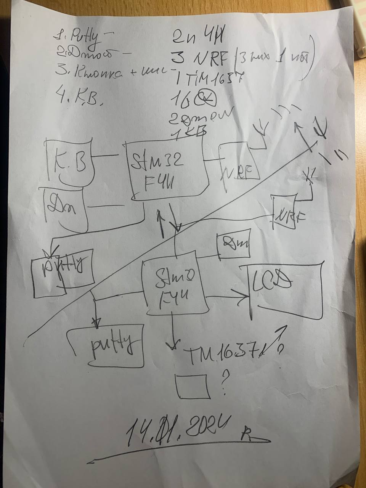

# radio_ctrl_lab
## Короткий огляд
  

### Завдання: 
Реалізація наведеної Радіо Керуючої Системи;

### Структура проєкту

#### Master  

*Master* зчитує значення з датчиків, виводе їх на термінал *Putty* і також *Slave'у* через радіоканал  

**Використаний Інвентар**:  
  - **STM32F411VE Discovery Board** - 1 [pc];
  - Single chip 2.4 GHz Transceiver **nRF24L01** - 1 [pc];  
  - **Joystick HW-504** - 1 [pc];

#### Slave  

*Slave* зчитує по радіоканалу значення передані Master'ом та виводе їх на *Putty* + дисплей

**Використаний Інвентар**:  
  - **STM32F411VE Discovery Board** - 1 [pc];
  - Single chip 2.4 GHz Transceiver **nRF24L01** - 1 [pc];  

### Релізи:

#### v1.0
  - вивід на пк(консоль) через USB OTG (CDC) простого "Hello, world!"
  
#### v1.1
  - підключено **nRF24L01** та реалізовано передачу в 1 бік
  
#### v1.2
  - підключено **Joystick HW-504** до *Master*
  
